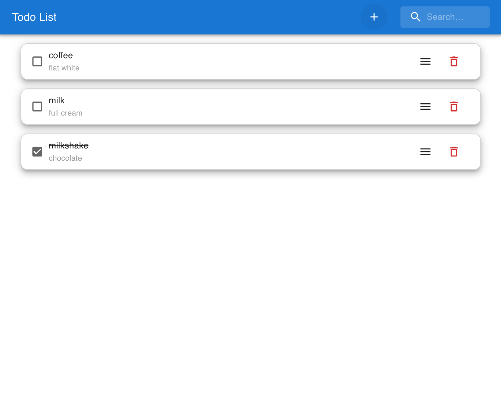
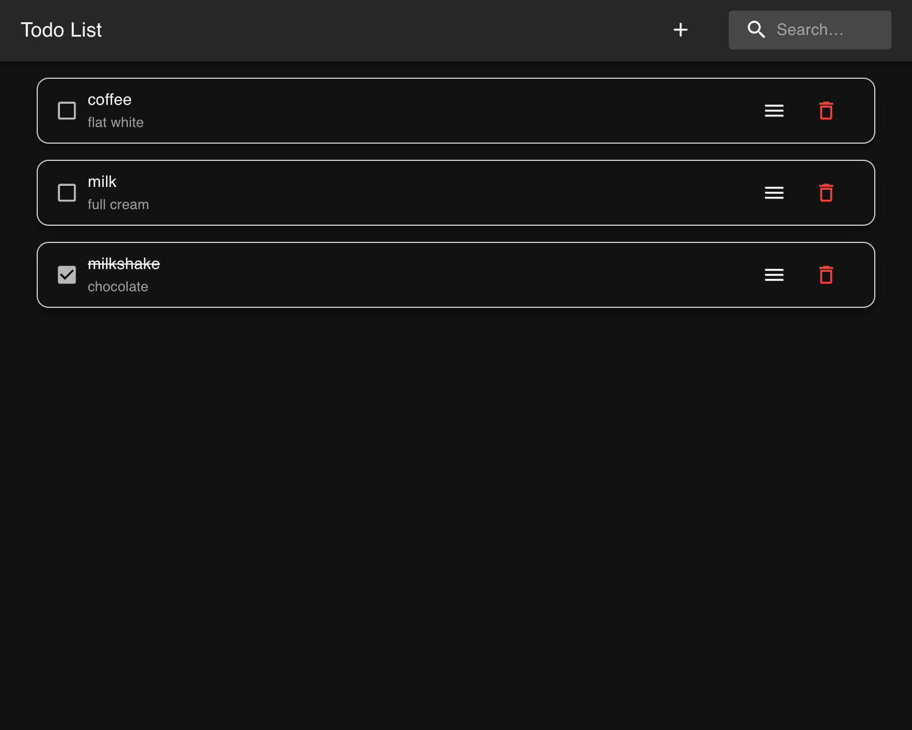

# Simple Todo List App

## Run the app

1. Clone the repo
2. Run `npm install` to install dependencies
3. Run `npx json-server -p 3500 -w data/db.json` to start the backend server
4. Run `npm start` to start the frontend server

## Features
1. Add a todo item.
2. Delete a todo item.
3. Edit a todo item.
4. Mark a todo item as completed.
5. Search todo items by title.
6. Dark mode and light mode support.

### Demo

Light mode (left) and dark mode (right)

​                                                

Features demo

